  

  <b>Backend Developer</b> — REST APIs · Automation · System Integration

  
  

---

### 🛠️ Tech Stack

**Backend**

**Frontend**

**Databases**

**Tools & DevOps**

**Game Dev**

**AI-assisted workflows**

---

### 📊 GitHub Stats

  
  

  

  Animated contribution graph (bubble-shooter style).
  1) Generate your SVG at https://man0dya.github.io/Readme-Contribution-Graph-Generator (username: facenach)
  2) Save it as "github-contribution-animation.svg" in the root of this repo
  3) Uncomment the line below

 

  

  

